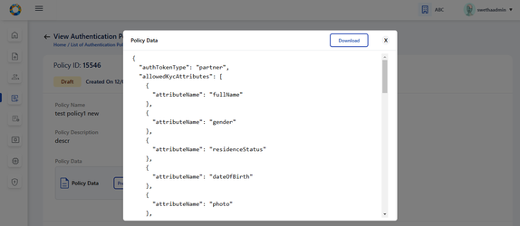
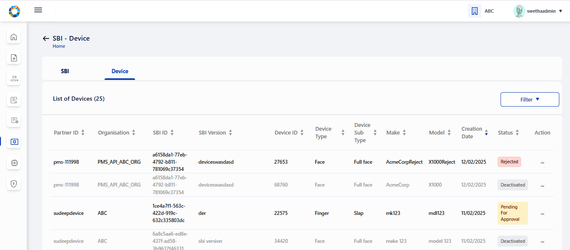

# End User Guide - Partner Admin & Policy Manager

## What all activities does a \'Partner Admin\' perform?

Partner Admin [supervises]{.mark} the overall partner and policy
management functionalities in PMS. The admin is responsible for:

-   Upload Root Certificate

-   Intermediate CA Certificates

-   Manage Partners and Policies

-   Approve / Reject new entries created by different partners or
    deactivate partner related records

Note:

Partner Admin can also assume the role of Policy Manager to

-   Create and manage policy groups and policies

## What all activities does a 'Policy Manager' perform? 

As a partner admin [cum]{.mark} policy manager a Policy Manager performs
following roles:

1.  Creation and management of Policy Group, Authentication Policy,
    Datashare Policy

**Notes**:

In UI - both PARTNER_ADMIN and POLICYMANAGER roles should be granted for
the '**POLICIES**' card to appear in the dashboard.

## Partner Admin / Policy Manager 

# Register as Partner Admin and Policy Manager

Partner admin too has to register [himself]{.mark} just like any other
'Partner Registration' by selecting any one of the partner type i.e.
Admin has to register in PMS with any one of the partner type.

## Registering as Partner Admin

Partner Admin can register in PMP as any one of the partner type and
then get the various roles/privileges by going to Keycloak.

## Using Keycloak to allocate 'Partner Admin' and/or 'Policy Manager'

After registration .....you need to come to keycloak..

1.  Go to keycloak and search your user name in Users tab.

2.  Go to the **Role Mapping** tab.

3.  In the **Available Roles** section, select **PARTNER_ADMIN** or
    **POLICYMANAGER**, click **Add** to move the selected role to the
    **Assigned Roles** list.

4.  You can now log in to the **PMS** portal with the same user
    credentials and you will have access to the **Admin Dashboard**.

**Note:** Add POLICYMANAGER role if Policies card should be made
accessible in UI

## [Allocating Policy Manager Role]{.mark}

By following the above steps (1-4) in keycloak, the admin can also
configure POLICY_MANAGER role to view and manage **Policies** card as
shown in the dashboard below:

**Notes:**

**1.** If only 'Policy Manager' role is configured in keycloak, then the
user will still be able to access as a normal partner. Hence 'Partner
Admin' & 'Policy Manager' roles are necessary to access all the cards
above.

2. After configuring the roles and if PMS portal is still logged in,
make sure to logout and login again for the roles to get updated.

# Certificate Trust Store

Certificate Trust Store provides features such as Upload, Download, View
Root CA and Intermediate CA certificates to Partner Admin such that at
the time of CA Signed Certificate upload by partner MOSIP verifies the
certificate chain of trust and then signs the partner's certificate
using MOSIP(PMS) private key.

-   Root Trust (Root CA) Certificate

-   Intermediate Trust (Intermediate CA) Certificate

## Root Trust (Root CA) Certificate

You can use the 'Root Trust (Root CA) Certificate' section to do the
following:

-   **Upload Certificate** -- Upload **Root CA** certificate such that
    the root of trust can be verified when an intermediate CA is
    uploaded.

-   **Download Root CA**: Download the root certificate as and when
    needed.

-   **View Root CA**

    -   **Root CA**: Tabular view of all uploaded Root CA certificates
        is displayed.

    -   **View Root CA Details**

## Root CA Certificate

### View Root CA Certificate

#### List of Root CA Certificates

{width="6.511805555555555in"
height="2.834722222222222in"}

#### Viewing Root CA Certificate

In Certificate Trust Store, the user can view the list of '**Root CA
Certificates**' uploaded by admin till date with details such as
**Certificate ID**, **Partner Domain**, **Issued To**, **Issued By**,
**Validity Period** and **Validity Status** (Valid / Expired)
[etc]{.mark}.

Each active certificate record has two options in action menu - **View**
and **Download** Certificate.

#### View Root CA details

On clicking View, the Root CA certificate detail can be viewed
individually.

#### Download Root CA

In the same page (Root CA details), an option to download the Root CA
certificate in .p7b file is also provided. Clicking on download, a
success message appears.

On opening the .p7b file from local system, the Root CA Certificate can
be viewed as below:

NOTE: any external installation required
[swetha.N](https://mosip.atlassian.net/wiki/people/636a272c11c69c7418450dbe?ref=confluence)
[Prathmesh
Jadhav](https://mosip.atlassian.net/wiki/people/712020:c6ee5f54-fc2c-4d62-986e-97ddd067ffd0?ref=confluence)
???

### Upload Root CA

To upload Root CA/ Intermediate CA Certificate, click on 'Upload Trust
Certificate'.

Admin is thus [navigated]{.mark} to Upload Trust Certificate page.

**Note**:

Admin can upload Root CA / Intermediate CA certificate in the same page
but should be in a sequential order ie. Root CA Certificate upload first
and then Corresponding Intermediate CA certificate upload.

Select the partner domain (AUTH / DEVICE / FTM) **in the Upload
section**. Partner Domain typically refers to the specific functional
area for which the **Root or Intermediate CA certificate** is being
uploaded.

-   AUTH: Select Partner domain as AUTH if **Root or Intermediate CA
    certificate** is being uploaded for Authentication Partner.

-   DEVICE: Select Partner domain as DEVICE if **Root or Intermediate CA
    certificate** is being uploaded for Device Provider.

-   FTM: Select Partner domain as FTM if **Root or Intermediate CA
    certificate** is being uploaded for FTM Chip Provider.

Note:

-   Only .cer or .pem format certificates are allowed for upload

-   Future dated certificates [is]{.mark} [should]{.mark} not
    [be]{.mark} allowed for upload, in case it is attempted an error
    message is thrown.

-   Only [Version 3]{.mark} certificate is allowed for upload.

-   If the corresponding root certificate is not uploaded, then while
    submitting the Intermediate certificate upload, an error message
    appears asking \'Please upload corresponding Root Certificate to
    proceed further\'.

**Note for Root CA Certificate**:

-   Issued To and Issued By is the same - which means these are self
    signed certificates.

## Intermediate Trust (Intermediate CA) Certificate

-   **Upload Root CA Certificate**: Partner Admin can upload
    **Intermediate CA** certificate so that the root of trust can be
    verified when a partner uploads Partner / FTM Chip Certificate.

-   **Download Certificate Chain of Trust**: Partner Admin downloads the
    certificate chain of trust of intermediate certificate as and when
    needed.

-   **View Intermediate CA**: Tabular view of all uploaded Intermediate
    CA certificates is displayed.

-   **View Intermediate Certificate details**: Uploaded intermediate
    certificate details is displayed along with the list of certificates
    within the certificate trust chain.

### Viewing the Intermediate CA Certificate

#### List of Intermediate CA Certificates

On clicking the Intermediate CA tab, List of all Intermediate CA
certificates uploaded by Partner Admin is displayed.

{width="6.516666666666667in"
height="2.8361111111111112in"}

Action menu for all active certificates displays the following options:

-   View

-   Download Certificate Chain

{width="6.5in"
height="2.8361111111111112in"}

#### Viewing the Intermediate CA Certificate

Either by clicking on the row item or the View option in action menu,
the admin is [navigated]{.mark} to View Intermediate CA Certificate
details page where the certificate details are displayed such as
Certificate ID, Partner Domain - (AUTH, FTM, DEVICE), Issued To-
*\<subject \> field of Certificate,* Issued By- *\<issuer \> field of
Certificate,* Valid From, Valid To*- same as system browser date format*
etc

### Downloading the Intermediate CA Certificate

Clicking on Download, downloads the entire certificate chain as .p7b
file and a success message is displayed - \'Certificate Chain of Trust
for the given Intermediate CA certificate is downloaded successfully\'.

**Note:** For expired status, 'Download Certificate Chain' button will
be disabled in View Root Certificate page / Tabular View page.

On clicking the .p7b file from local system, the certificate hierarchy
of the intermediate CA certificate is present where its corresponding
root certificate is also downloaded.

### [Upload Intermediate Certificate]{.mark}

To upload the Intermediate CA certificate, carry out the same steps of
Root CA Certificate upload.

**Note for Intermediate CA Certificate**:

-   The Subject of the root certificate matches the Issuer of the
    intermediate certificate.

-   Issued To and Issued By are different as the Intermediate CA
    certificate is signed by the Root CA.

-   Intermediate certificate must expire before its root certificate.

-   Validity of Root CA Certificate \> Intermediate CA Certificate \> CA
    Signed Partner Certificate

-   Sequence of Upload: Root CA Certificate (by Partner Admin)→
    Intermediate CA Certificate (by Partner Admin) → CA signed Partner
    Certificate (by Partner)

# **Partners**

As a **Partner Admin** you can view the list of all partners who have
enrolled to PMS portal by clicking on the Partners card dashboard / side
panel / hamburger menu, [so that their consolidated details along with
partner certificate details is available all in one screen]{.mark}.

## This [card]{.mark} / [Section]{.mark} has the following features:

1.  Tabular View of Partner detail (Action menu: View, Deactivate)

2.  View individual Partner detail and [with]{.mark} certificate details

3.  Download original Partner Certificate and MOSIP Signed certificate

4.  Deactivate Partner

**Note:** Deactivate option appears disabled if the partner is
deactivated.

### View Partner Details

Click on a row item or use the view option in action menu you come to
'Partner Details Page' to view the Partner Details such as **Partner
type**, **Organisation name**, First Name, Last Name, Phone Number,
Email Address, Policy Group (If partner is of the type Authentication
Partner). Partner certificate details are also visible.

### Download original certificate / MOSIP Signed certificate

The admin can download original certificate / MOSIP Signed certificate
as and when necessary.

**Notes:**

The download functionality of following certificates is possible only
during following instances:

-   This button is enabled only for Activated partner record whose
    certificate is already uploaded.

-   This button is disabled for deactivated partner records/ partner
    records whose partner certificate is not uploaded yet.

-   If Original Certificate / MOSIP Signed Certificate is expired then
    on clicking respective menu items in the button-dropdown - an
    appropriate error message is displayed.

On downloading the Original / MOSIP Signed certificate, a success
message appears.

### [Deactivate a Partner]{.mark}

To deactivate a partner, click on Deactivate option in action menu. A
popup window appears seeking for confirmation from the partner.

After confirming deactivation, the respective record is greyed out in
the tabular view. The action menu here appears enabled with only 'View'
option after deactivation and Deactivate in action menu is disabled.

**Note:** After deactivation, the View partners page will display the
following-

1.  \'Deactivated\' status

2.  Certificate section is greyed out with and download button is
    disabled.

The deactivated partner will not be able to create or utilize any of the
services in their PMS portal (For e.g. no new transactions will work
such as creation of OIDC Client , API Key etc).

**Known Issue:** Even after partner deactivation, partner is able to
access the existing transactions in their PMS portal such as

1.  Existing OIDC client ids are still operational for Authentication
    Partner.

2.  Existing API keys are still operational for Authentication Partner.

3.  SBI / Devices / FTM - trust validation does not fail even after
    partner deactivation.

# **Policies**

You can use the 'Policies' section/card for creation and management of
Policy Group, Authentication Policy, Datashare, You should have
privileges of both; Partner Admin and Policy Manager.

This [card]{.mark} / [Section]{.mark} is accessible only if both
**Partner Admin** and **Policy Manager** roles are configured /
allocated.

In [UI -]{.mark} both Partner Admin and Policy Manager roles must [have
been]{.mark} granted for the card to appear in the dashboard.

On clicking Policies card, [three tabs - **Policy Group, Authentication
Policy, Datashare Policy**]{.underline} are displayed, **Policy Groups**
tab is selected by default.

Policy Group

-   Create Policy Group

-   View Policy Group

    -   Tabular view of previously created Policy Groups along with the
        stat

    -   View created Policy Group details individually

-   Deactivate Policy Group

 

Authentication Policy

-   Create Authentication Policy: by mapping to an already created
    Policy Group

-   View Authentication Policy

    -   Tabular view of previously created Authentication Policy along
        with the status

    -   View created Authentication Policy details

-   Deactivate Authentication Policy

-   Clone Authentication Policy: in different policy groups on clicking
    Clone option in action item of activated/ deactivated records in
    Tabular view screen

-   Edit Authentication Policy: which is in draft status

-   Publish Authentication Policy: which is in draft status so that the
    status changes to 'Activated'.

 

Datashare Policy

-   Create Datashare Policy - clicking on this button navigates to
    Create Policy Group

-   View Datashare Policy:

    1.  Tabular view of previously created Datashare Policy along with
        the status

    2.  View created Datashare Policy details

-   Deactivate Datashare Policy

-   Clone Datashare Policy in different policy groups on clicking Clone
    option in action item of records in Tabular view screen

-   Edit Datashare Policy which is in draft status.

-   Publish Datashare Policy which is in draft status so that the status
    changes to 'Activated'.

## Policy Group

### View Policy Groups

All the policy groups created so far by Partner Admin / Policy Manager
are displayed on 'List of Policy Groups' page.

### Create Policy Group

On clicking the 'Create Policy Group' option on the top right of the
screen, we can create a Policy Group by providing suitable name and
description that is self explanatory for partners, who would be
selecting them during Partner Policy Request to create API Key / OIDC
Client [etc]{.mark}.

On click of Submit, a success message appears.

### View Policy Group

Admin can either click on 'Go Back' to redirect to 'List of Policy
Groups' page as shown below or click on 'Home' to navigate back to Home
page/ dashboard.

The options provided in \'Action menu are: View, Deactivate.

Clicking on View in action menu or by clicking the row item itself,
admin is navigated to View Policy Group page where the policy group
details are displayed along with its status: Activated or Deactivated.

### [Deactivate Policy Group]{.mark}

If the admin wants to deactivate the Policy Group, then click on
Deactivate option in action menu.

> A popup window appears seeking for confirmation before proceeding to
> deactivate.

After confirming deactivation, the respective record is greyed out in
the tabular view.

The action menu here [should be]{.mark} enabled with only View option.
(Deactivate in action menu is disabled).

After deactivation, the View policy group page
[MOSIP-36963](https://mosip.atlassian.net/browse/MOSIP-36963) will
display \'Deactivated\' status

Once the policy group is deactivated by Policy Manager, the partner will
not be able to fetch this policy group in any of the screens in their
[PMS portal]{.mark}.

**Note:**

Policy Group cannot be deactivated if there are active or draft policies
associated to the given policy group.

If the Policy Group has active or draft policy / policies associated to
it, then on clicking Confirm, following error message is displayed along
with the count of such policies-

a\) In case of Active and Draft policies associated to Policy Group:

b\) In case of Active policies associated to Policy Group:

c\) In case of Draft policies associated to policy group:

## Authentication Policy / Datashare Policy:

-   On clicking Authentication Policy tab, List of all previously
    created Authentication Policies are displayed.

-   On clicking Datashare Policy tab, List of all previously created
    Datashare Policies are displayed.

Note: The steps and features are same for both Authentication and
Datashare Policy.

Policies can have the following status - Draft, Activated or
Deactivated.

1.  Only Draft or Activated row items are clickable which
    [navigates]{.mark} to View Authentication Policy details.

2.  Action - Action menu displays a common menu item (View, Clone,
    Deactivate) with only the following menu items enabled for clicking
    based on below statuses:

    1.  Draft → Publish, View, Edit

    2.  Activated **→** View , Clone , Deactivate

    3.  Deactivated → View

### [Create Authentication Policy]{.mark}

On clicking 'Create Authentication Policy' button, Partner Admin /
Policy manager is navigated to Create Authentication Policy page where
details such as policy group, policy name, description etc will have to
be entered

**Note**:

Only active policy groups are available in the policy group dropdown.

Click on the upload button to upload policy data . Only json files are
allowed for upload.

Before saving the policy in draft, the policy data can be edited in the
text area after policy data json file has been successfully uploaded.

On clicking on Save as Draft, following success message appears.

On clicking 'Go Back', admin is navigated back to tabular view where the
policy is saved as 'draft' status.

The Edit option provided to Draft policy can be used by admin to make
any changes in the policy details (except policy group) before
publishing the policy.

On submitting after making required changes, a success message appears.

To publish policy which is currently in draft status, click on 'publish'
option in action menu. A popup window appears seeking for confirmation
to publish.

On clicking Publish, a success message appears . Click on close to close
the window.

The given policy changes to 'Activated' status after being published.
Once activated, the admin cannot edit the policy, hence the option is
disabled.

### [Clone Policy]{.mark}

To clone any active policy onto another policy group, click on 'clone'
in action menu. A popup window appears to select the policy group where
the policy has to be cloned.

On selecting the policy group where policy has to be cloned, click on
Clone and a success message appears.

Click on Close to navigate back to List of Authentication Policies
screen.

### [Deactivate Policy]{.mark}

To deactivate a policy, click on Deactivate option in action menu of any
activated policy record. A popup window appears seeking for
confirmation.

Note:

If the Policy has active partners associated to it i.e. there are
**Approved** partner policy requests, then on clicking Confirm,
following error message is displayed and the admin will be restricted to
deactivate such policy groups.

**Note:**

1.  Policy can be deactivated if there are no policy requests associated
    with this policy

2.  Policy can be deactivated if there are Rejected policy requests
    associated with this policy.

3.  Policy cannot be deactivated if there are pending policy requests
    associated with this policy. In this case , following error message
    is displayed- '\<title\> Error: Partner - Policy Request Detected!
    \<Description\> Pending policy requests are associated with this
    policy. Please take appropriate action in List of Partner Policy
    Linking screen'

4.  Once the policy is deactivated by partner admin/policy manager, the
    partner will not be able to fetch this policy in any of the screens
    in their PMS portal.

### Viewing Policy

On clicking **View** option of any policy or by clicking the row item
itself, admin is navigated to View Authentication Policy where policy
details can be viewed. Also click on preview to view the policy data in
json format.

On clicking preview, policy data can be viewed in json format and an
option to Download the data in local system is provided.

## Partner - Policy Linking:

The features provided to Partner Admin:

1.  Approve/ Reject Policy requested by partner - clicking on 'Approve/
    Reject' option in action menu of a policy record whose status is in
    pending for approval

2.  Tabular view of Policies requested by partners along with the status

3.  View individual policy request details : Either on clicking on view
    option in action menu of any of the active policy request in the
    tabular view or by clicking on the row item itself, it navigates to
    View Policy Request details page.

All the policy requests created by various partners are displayed in
'List of Partner - Partner Linkages\' . The different statuses possible
are: Pending for Approval, Approved, Rejected, Deactivated.

The options provided for policy linking requests in 'Pending for
Approval' are to Approve/ Reject. Also an option to view the policy
request details is also provided.

On clicking the Approve/ Reject option, the window appears - and partner
admin can click on either Approve or Reject to take appropriate action

The status- Approved / Rejected gets updated in the tabular view.

On clicking view of active record or the row item itself, the partner-
policy linking view page is displayed along with comment history where
partner comments and admin's approval status is displayed.

# **SBI - Device:**

This card is exclusively used to manage Device Provider's requests on
SBI and Device creation.

1.  The \'SBI-Devices\' option will have the following features:

    1.  [2 Tabs- **SBI and Device**]{.underline} are displayed. SBI tab
        view is selected by default

#### **SBI features**

-   Tabular view of SBIs created by Device Providers along with the
    status

-   Approve/ Reject SBIs on clicking Approve/Reject in action menu of
    Pending for Approval records

-   View submitted SBI details : Either on clicking on view option in
    action menu of any of the submitted SBI details in the tabular view
    or by clicking on the active row item itself, it navigates to View
    SBI details page

-   Deactivate an SBI on clicking Deactivate option in action item of
    activated records in Tabular view screen

-   Linked Devices of a given SBI can be viewed through a filtered
    search on the pre-selected SBI

 

#### **Device features:**

-   Tabular view of Devices created by Device Providers along with the
    status

-   Approve/ Reject devices on clicking Approve/Reject in action menu of
    Pending for Approval records

-   View submitted Device details : Either on clicking on view option in
    action menu of any of the submitted API key details in the tabular
    view or by clicking on the row item itself, it navigates to View
    device details page

-   Deactivate device on clicking Deactivate option in action item of
    activated records in Tabular view screen

-   List of all SBIs created by various different device providers are
    available here. Any SBIs that are pending for approval can be
    approved/ rejected

## Approve or reject SBI

The SBI can be approved or rejected by partner admin by going to
Dashboard → SBI-Device → List of SBIs.

The admin selects on Approve/ Reject option from the given record and
chooses appropriate action.

On approval, the status changes to 'Approved' and on rejection, the
status changes to 'Rejected'

To view any individual records, click on View option in the action menu.

To approve or reject an SBI, select the approve / reject option in
action menu.

The approved / rejected status is updated on the tabular view.

To know the list of linked devices associated to this SBI, click on the
linked devices count in the tabular view or in the individual view page.

## Deactivate and SBI

To deactivate an SBI, click on Deactivate option in action menu. An
alert appears seeking for confirmation. Also admin is informed how the
linked devices will be impacted after SBI deactivation.

After confirming Deactivation: the respective SBI record is greyed out
and the status is displayed as 'Deactivated'.

### Impact on linked devices after SBI deactivation

Impact on linked devices after SBI deactivation is as below

1.  All approved device records are displayed in 'Deactivated\' status
    and those row items being greyed out. The action menu in such
    records should be enabled with only View option. (Deactivate in
    action menu is disabled)

2.  The devices of which the status was 'Pending for Approval' before
    SBI deactivation will now be displayed with 'Rejected' status.

3.  Rejected devices will continue to remain in the same status even
    after SBI deactivation.

## **Device**

### View Devices

On clicking 'Devices' tab, **List of all Devices** submitted so far are
displayed.

### Approve / Reject Devices

On clicking the action menu of the respective device record, an option
'Approve / Reject' is provided

A popup window appears for the admin to take appropriate action-
APPROVE/ REJECT and select the respective button

The status is thus updated accordingly in **List of Devices** Page as
Approved / Rejected based on the above action.

\'Pending for Approval\' status is displayed when the device request is
pending with admin for approval and no action has been taken by admin
yet.

Click on view option in action menu or the row item itself (of any
active device record) to view the device details individually

### Deactivate Device

Click on deactivate option in action menu . A confirmation window
appears to proceed for deactivation.

The deactivated device record is greyed out and status is also changed
to 'Deactivated'

# **FTM Chip:**

The following features are provided to admin to manager FTM Chip
Provider's requests:

-   [Tabular view of FTM chip details]{.underline} along with the status
    of approval

-   [Approve/ Reject]{.underline} FTM chip details submitted by FTM Chip
    Providers

-   [View FTM details]{.underline} : Either on clicking on view option
    in action menu of active FTM Chip details in the tabular view or by
    clicking on the row item itself, it navigates to View FTM details
    page

-   [Download FTM Chip Certificate]{.underline} : On clicking on
    Download option within FTM Chip Certificate section in 'View FTM
    Chip Certificate' page, then originally uploaded FTM Chip
    certificate can be downloaded

-   [Deactivate FTM detail]{.underline} : On clicking on 'Deactivate\'
    option in action menu of approved records in Tabular view of FTM
    details screen, the respective FTM detail along with its certificate
    will be deactivated.

View FTP Chip Details

The List of FTM Chip details displays all FTM Chip details created by
FTM Chip Provider

The admin navigates to 'List of FTM Chip details' page where list of all
FTM Chip records submitted so far by different FTM Chip providers are
displayed.

Approve / Reject FTM Chip

On clicking the action menu of the respective FTM Chip record, an option
'Approve/ Reject' is provided

 

A popup window appears for the admin to take appropriate action-
APPROVE/ REJECT and select the respective button

 

The status is thus updated accordingly in **List of Devices** Page as
Approved / Rejected based on the above action.

 

Note: \'Pending for Approval\' status is displayed when the FTM Chip
request is pending with admin for approval and no action has been taken
by admin yet.

View Details of FTM Chip 

To view FTM Chip details indivudally, click on View option in action
menu

Download FTM Chip Certificate

To download the FTM Chip Certificate uploaded by FTM Chip Provider,
click on download button.

To deactivate an FTM Chip record, click on Deactivate option in action
menu and a confirmation popup appears.

The deactivated FTM Chip record is greyed out after deactivation.

# **Authentication Services:**

The screen will have the following features:

1.  [Two tabs namely **OIDC Client and API key**]{.underline} are
    displayed. OIDC Client tab view is selected by default [as shown in
    UXD]{.mark}.

#### OIDC Client

-   [Tabular view of OIDC clients created by partners]{.underline} along
    with the status

-   [View submitted OIDC Client details]{.underline} : Either on
    clicking on view option in action menu of any of the submitted OIDC
    details in the tabular view or by clicking on the row item itself,
    it navigates to View OIDC Client details page

-   [Deactivate]{.underline} an OIDC Client on clicking Deactivate
    option in action item of activated records in Tabular view screen

#### API Key

-   [Tabular view of API keys]{.underline} [generated by
    partners]{.underline} along with the status

-   [View submitted API Key details]{.underline} : Either on clicking on
    view option in action menu of any of the submitted API key details
    in the tabular view or by clicking on the row item itself, it
    navigates to View API key details page

-   [Deactivate]{.underline} API key on clicking Deactivate option in
    action item of activated records in Tabular view screen

## OIDC Client

View OIDC Clients

Within OIDC Client tab, all OIDC Clients created by various
Authentication partners are displayed.

For Activated records → the action menu has two options: View,
Deactivate

For Deactivated records → the action menu is enabled with only 1 option:
View, Deactivate.

On clicking view option in action menu, the admin is redirected to View
OIDC Client details page.

### Deactivate OIDC Client:

On clicking view option in action menu, the admin is redirected to View
OIDC Client details page.

### 

## API Key

### View API Key

To view the list of all API Keys created by Authentication partner,
click on API Key tab

For Activated records → the action menu has two options: View,
Deactivate

For Deactivated records → the action menu is enabled with only 1 option:
View, Deactivate.

On clicking view option in action menu, the admin is redirected to View
API Key details page.

### Deactivate an API Key

To deactivate an API Key, click on deactivate option in action menu.

The deactivated record is greyed out and is updated with Deactivated
status.

