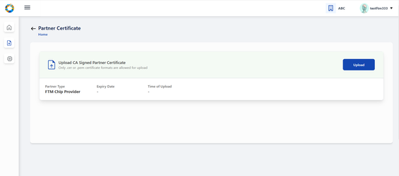
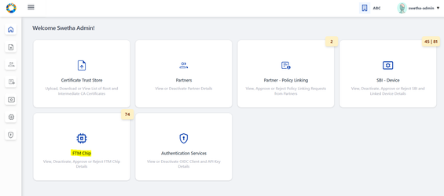
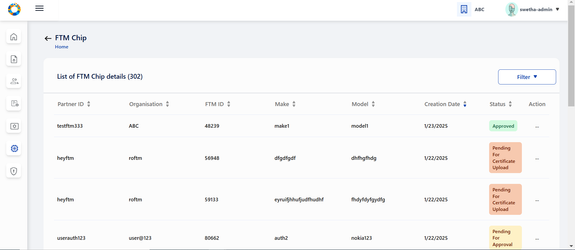

# End User Guide

**Partner Management Portal (PMP) is used by both; PMS Admin and Partner
User.**

-   Partner Administrator: Partner Admin

-   Partners: Partner User

## What all activities does a 'Partner Admin' perform for FTM Chip Provider?

Being a 'Partner Admin' you can perform following 3 activities to
complete the end to end functionality pertaining to Device Provider.

-   Upload Root CA and Sub CA Certificates

-   Approve/Reject FTM Chip

### Upload Root CA and Sub CA

Only after Partner Admin 'Upload Root CA and Sub CA Certificates' that a
Partner will then be able to **Upload CA signed Partner Certificate**.

As a process of Partner onboarding onto PMP after successful
registration, Partner is required to **Upload CA signed Partner
Certificate** on behalf of their organisation which would be used to
build a trust store in MOSIP to cryptographically validate that they are
from a trusted organisation.

**Certificate Authority (CA)** is an organization that acts to validate the identities of entities (in this case, a partner organisation) and bind them to cryptographic keys through the issuance of electronic documents known as digital certificates. A country needs to onboard valid CAs before onboarding any partner as MOSIP will only accept certificates which are signed only by a Trusted CA.

#### Upload Root CA and Sub CA Certificates

1.  Go to **PMS Portal and login as Partner Admin**. Click on
    **Certificate Trust Store** in Admin dashboard

2.  Within Root CA tab - click on **Upload Trust Certificate** button on
    the top-right of the screen.

3.  Select the Partner Domain, (FTM)

4.  Choose the **Root CA Certificate** to upload (only files with
    extensions as .cer or .pem).

5.  Click Submit and an appropriate success message appears.

6.  Similarly, sub/intermediate CA certificate should be uploaded by
    following the above steps (2-4) by navigating to **Upload
    Intermediate CA Certificate** button provided within Intermediate
    Root CA tab.

## FTM Chip Provider Workflow

To be able to access the services by PMP and to validate that the
partner is from a trusted organisation, undergoing self registration on
PMP and uploading CA signed certificate is necessary'.

-   Self Register on PMS Interface

-   Upload CA signed Certificate

### Self-Register on PMP as FTM Chip Provider

1.  The FTM Chip Provider can register themselves on MOSIP PMS portal by
    clicking **Register** on the Login Page, a form comes up.

2.  Enter the FTM Chip Provider details:

    1.  Partner type (FTM Provider)

    2.  First and Last name

    3.  Organization Name

    4.  Address, Phone number

    5.  e-mail, Username and password

 

 

3.  **On successful registration**, you will be asked to read through
    '**Terms and Conditions**' and having carefully read through it you
    can agree and accept it.

 

**Validations**:

-   Terms & Conditions: Partner consent refers to voluntary and informed
    agreement provided by a partner user on behalf of the Partner
    Organisation, to a specific action or process where the users have a
    clear understanding of what they are consenting to. User consent is
    important to ensure data privacy, where it is compliant to obtain
    explicit consent from partners before collecting, processing, or
    sharing their personal / organisation level data.

-   A detailed description explaining which of their personal and
    organisation data is used and for what purposes it will be used in
    PMP will be informed while seeking user consent.

### Login:

-   For existing partner users who are already registered in Partner
    Management Portal, they can login to the portal with their email, username and password.

-   On logging in you come to Partner Dashboard
    (considering the pre-requisites such as policy group selection and
    consent are already completed)

### Forgot Password:

-   Partner user has an option to reset password , you can use it when you forget password 
    or want to change password after a certain duration.

### CA Signed Partner Certificate Upload / Download or Re-Upload

User is now in **[[Home
Page/Dashboard]{.underline}](https://docs.mosip.io/1.2.0/modules/partner-management-services/pms-revamp/functional-overview/auth-partner/end-user-guide#interface-overview)**
where the following features are provided to FTM Chip Provider: 

1. Partner Certificate
2.FTM Chip Provider Services

These features can also be accessed by clicking on side panel (in the
form of icons) or clicking on the hamburger menu on the top left which
is available across all screens of PMP to help user easily navigate.

Once registered as a process of Partner onboarding onto PMP after
successful registration, user is required to perform upload CA signed
Partner Certificate on behalf of their organisation which would be used
to build a trust store in MOSIP to cryptographically validate that they
are from a trusted organisation........

**Tips**:

Later when required a Partner can also 'Download Certificate' and
'Re-Upload Certificate' (As the need may be).

Important:

Before a Partner can upload a 'CA Signed Certificate' it is prerequisite
that the 'Partner Admin' should have already had uploaded the **Root CA** and **Intermediate CA** certificates.

#### To Upload CA signed Certificate

1.  Go to **FTM Provider** > **Dashboard**.

2.  Click on **Partner Certificate** option, Click on the **Upload**
    button to upload the partner certificate signed by CA.

3.  Select the CA signed partner certificate from local system by
    tapping on the upload section (blue area).

4.  The required certificate is selected from the local system.

5.  Certificate is successfully fetched from local system.

6.  Click on **Submit**, Partner Certificate is uploaded successfully.

7.  On closing the popup, The user can view the uploaded certificate
    details in the form of a list view.

#### Download Certificate

There is also an option to download initially uploaded CA signed
certificate and also the MOSIP Signed Certificate.

Success Message is displayed on successful download of Originally
uploaded certificate/ MOSIP Signed Certificate.

On closing the popup the user can view the uploaded certificate details
in the form of a list view.

#### Download Certificate

There is also an option to download initially uploaded CA signed
certificate and also the MOSIP Signed Certificate.

#### Re-Upload Certificate

Re-uploading certificate is required in cases when MOSIP Signed
Certificate gets expired after one year.

**Note:**

'MOSIP Signed Certificate has a validity of 1 year from the time of
Partner Certificate Upload.

You must ensure that you re-upload the partner certificate again so that
new MOSIP signed certificate can be generated and other functionalities
such as FTM Chip Provider Services can function.

The rest of the steps is same as covered in Upload Certificate flow
(Step 3-7)

## FTM Chip Provider Services

After the partner has uploaded partner certificate he can now perform
'FTM Chip Provider Services':

-   **Add** FTM Chip details and **upload** the FTM Chip certificate for
    the request to be sent to partner admin for approval.

-   **Deactivate** FTM details.

-   **Re-upload** and **Download** FTM Chip Certificate.

### **Add FTM Chip:**

You can add details of Foundational Trust Module (FTM) chip by clicking
on 'Add FTM Chip' button which takes you to 'Add FTM Chip Details'
screen.

The partner is expected to enter the make and model of FTM Chip and
submit the details.

After successful submission of FTM Chip details, the partner is prompted
to click on 'Upload FTM Chip Certificate' to proceed further.

The partner clicks on the Upload section to select the FTM Chip
Certificate from local system.

After selection, the uploaded certificate is displayed on screen which
the partner has to submit.

A success message on successful submission is displayed on the screen.

On click of Close you come back to List of FTM Chip details
page where the status of the record is in 'Pending for Approval status'.

Let's assume, the certificate upload process was not carried out after
adding FTM details due to a technical issue / unexpected closing of
the PMS portal. At such instances, while navigating to FTM Chip Services
Dashboard → List of FTM Chip details, the given record is found to be in
'Pending for Certificate Upload' status. Which means that without the
certificate upload the record will not go to admin for approval..

To upload the FTM Chip certificate, select the Manage Certificate option
from action menu.

The partner is navigated to Manage FTM Chip certificate page where on
clicking upload button, the partner can upload the certificate by
following the same steps as mentioned above.

Once the upload is complete - the record moves to 'Pending for Approval'
status where the Partner Admin can take appropriate action by approving
/ rejecting this entry.

### Partner Admin

To approve / reject an FTM Chip, admin clicks on 'FTM Chip' card in his
homepage.

The admin navigates to 'List of FTM Chip details' page where list of all
FTM Chip records submitted so far by different FTM Chip providers are
displayed.

On clicking the action menu of the respective FTM Chip record, an option
'Approve/ Reject' is provided.

A popup window appears for the admin to take appropriate action-
Approve / Reject and select the respective button.

The status is thus updated accordingly in **List of Devices** Page as
Approved / Rejected based on the above action.

**Note**:

'Pending for Approval' status is displayed when the FTM Chip
request is pending with admin for approval and no action has been taken
by admin yet.

### Manage Certificate for approved records

Once the FTM Chip record is approved, FTM Chip Provider can click on
Manage Certificate option in action menu so that the partner can
download / reupload the FTM Chip certificate in Manage FTM Chip
Certificate page.

To re-upload certificate after expiry or otherwise, click on Re-Upload
button.

Follow the same steps as upload flow to perform the reupload
functionality.

After reupload of certificate is successfully completed, the status
again changes to 'Pending for Approval' as the renewed certificate
needed to go through admin check for the FTM Chip record to be
validated.

Every Approved FTM Chip record has a download option provided to
download the FTM Chip certificate at any given time.

on click of download button, a success message is displayed on the
screen.

### Deactivate FTM Chip

Partner / Partner Admin can deactivate an active FTM Chip any time
provided it is in 'Approved' status. 
To perform deactivation, click on
'Deactivate' option in the action menu of the given FTM Chip in 'List of
FTM Chip details' page.

On clicking 'Deactivate', a popup window appears seeking for
confirmation and appropriate info text is displayed.

on deactivation , the status changes to 'Deactivated' status.

